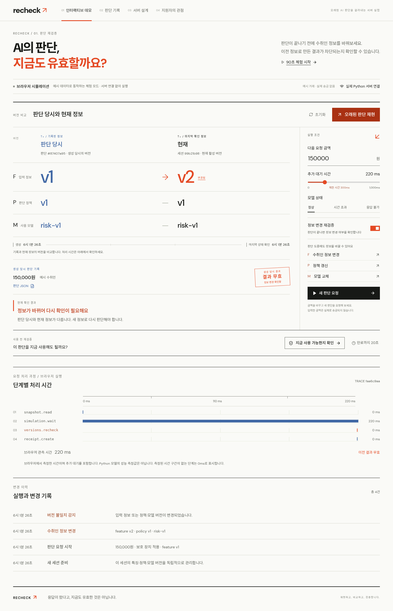
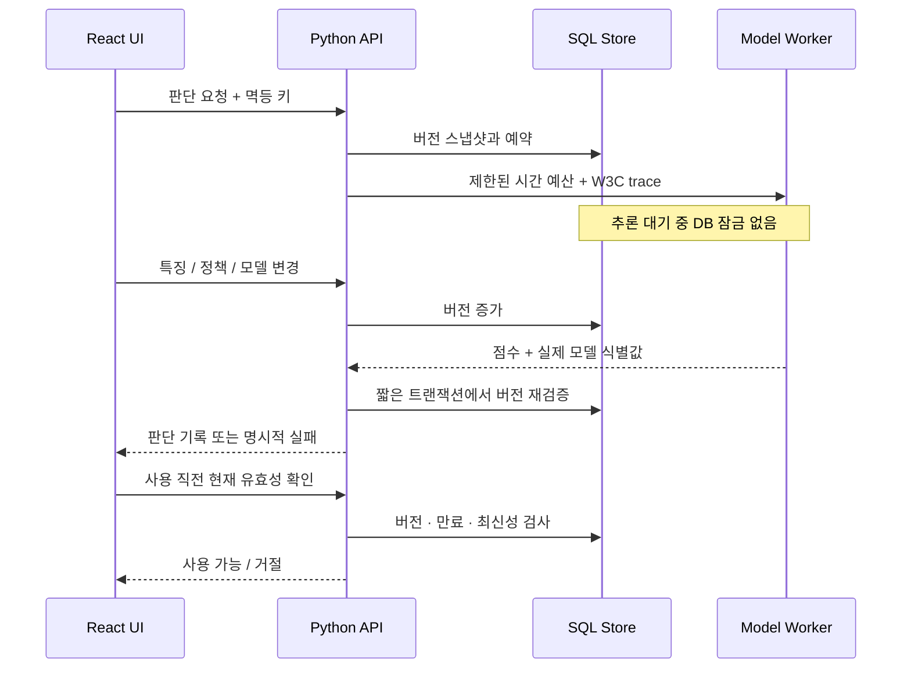

# RECHECK

### AI의 답에도, 유효기간이 있습니다.

**추론이 성공했다는 사실과, 그 결과를 지금 사용해도 된다는 사실은 다릅니다.**

RECHECK는 송금 전 확인이라는 합성 시나리오에서, 모델이 계산하는 사이 입력·정책·모델이 바뀌면 오래된 판단을 차단하는 Python ML 서빙 실험실입니다. 고객에게 보이는 한 문장부터 모델 서버의 trace, 버전, 실패 원인까지 연결합니다.

[바로 체험하기](https://sokldjs554.github.io/recheck-ml-serving/) · [실제 Python 호스트](https://recheck-ml-serving.onrender.com/) · [공고 항목별 증거](docs/job-coverage.md) · [90초 시연 가이드](docs/interview-demo.md) · [조사와 차별점](docs/research.md) · [설계 선택](docs/decisions.md) · [검증 기록](docs/verification.md) · [백엔드 상세](backend/IMPLEMENTATION.md)



## 면접관에게 보여줄 세 가지

1. **같은 실패를 직접 재현합니다.** ‘추론 중 변경 재현’을 누르고 보호 장치를 끄면 오래된 답이 통과합니다. 보호 장치를 켜면 동일한 변경이 결과를 무효화합니다.
2. **성공 응답 뒤도 확인합니다.** 판단을 받은 뒤 정책을 갱신하고 ‘현재 판단 사용 검증’을 누르면 사용이 거절됩니다. 생성 당시의 기록은 그대로 남습니다.
3. **장애를 감추지 않습니다.** 모델 응답 불가·시간 예산 초과·수용 한도 초과를 구분합니다. 실제 서버 연결이 실패하면 오류를 표시하며 시뮬레이션으로 몰래 전환하지 않습니다.

첫 화면은 설치 없이 즉시 실행되는 **브라우저 시뮬레이션**입니다. GitHub Pages는 이 모드를 제공합니다. Python 호스트 또는 로컬 실행 화면에서는 **실제 Python 서버 연결 → 주소를 비운 채 연결 확인**으로 같은 호스트의 API와 독립 모델 프로세스를 사용합니다. 다른 API에 연결하려면 주소와 해당 서버의 CORS 허용 설정이 필요합니다. 무료 Python 호스트가 잠들어 있으면 첫 연결에 시간이 걸릴 수 있습니다.

## 왜 이 주제인가

토스뱅크 ML Backend Engineer 공고의 핵심을 모델 정확도 경연보다 **추론을 감당하는 서버의 신뢰성, 장애 경계, 관측, 비용을 설명하는 능력**으로 읽었습니다. 공개 합격 후기 작성자 2명의 프로젝트 4개를 조사했고, 성능 수치 자체보다 문제를 좁히고 선택을 검증한 과정이 참고할 지점이었습니다. 합격의 원인이나 실제 제출 여부는 공개 자료만으로 단정하지 않았습니다. [출처와 비교표](docs/research.md)

흔한 챗봇이나 추천 서비스 대신 **‘AI 결과의 최신성을 언제, 어디에서 보장할 것인가’**를 주제로 선택했습니다. 일반적인 낙관적 동시성 제어를 새로 발명했다고 주장하지 않습니다. 차별점은 이를 ML 서빙의 시간 예산·모델 교체·판단 기록·고객 안내로 이어 붙여, 깨지는 순간까지 체험하게 만든 데 있습니다.

## 구조



- **FastAPI · SQLAlchemy · PostgreSQL:** 같은 세션 행을 잠그는 예약·변경·최종 검증, 변경된 본문의 멱등 키 재사용 거절.
- **별도 HTTP 모델 서버:** 실제로 학습한 scikit-learn 로지스틱 회귀, 모델 epoch와 파라미터 해시.
- **제한된 동시 실행과 대기:** API 8+16, 모델 2+8 기본값, 기본 시간 예산 300ms, 실패 원인 보존.
- **OpenTelemetry:** 실제 SDK와 W3C context 전파, JSON 판단 기록과 타임라인. OTLP exporter 선택 가능.
- **React · TypeScript:** 고객 화면, 실패 주입, 경쟁 조건 재현, 판단 JSON, 90초 가이드, 지원자의 관점, 모바일 대응.

| 구성 | 저장소 | 실행 범위 |
|---|---|---|
| 브라우저 모드 | 탭 메모리 | 규칙과 대기 시간을 이용한 교육용 모사 |
| GitHub Pages 공개 데모 | 탭 메모리 | 설치 없는 인터랙티브 시뮬레이션 |
| Render 공개 Python 서버 | 임시 SQLite | 실제 API·모델 별도 프로세스, 외부 HTTP 검증과 매시간 합성 점검 |
| Docker Compose | PostgreSQL 16 | DB·API·모델 별도 컨테이너 |
| Kubernetes 실험 환경 | PVC PostgreSQL | 복제 API·모델, 배포·복구 검증. 실행 범위는 [클러스터 기록](docs/kubernetes.md) 참조 |

## 로컬 실행

```bash
git clone https://github.com/sokldjs554/recheck-ml-serving.git
cd recheck-ml-serving
docker compose up --build
# http://localhost:8000
```

Python으로 실행하려면:

```bash
python3.12 -m venv backend/.venv
backend/.venv/bin/pip install -r backend/requirements.txt
backend/.venv/bin/python scripts/serve_demo.py
# http://localhost:8000 — 저장된 web_static 빌드 사용
```

프런트엔드를 수정했다면 Node 24에서 `python scripts/build_demo.py`로 재빌드합니다. Render Python 배포가 프런트엔드 툴체인을 요구하지 않도록 `web_static/`을 함께 저장합니다. CI에서 소스와 배포 번들의 일치 여부를 검사합니다.

```bash
PYTHONPATH=backend backend/.venv/bin/pytest backend/tests -q
cd demo
npm ci
npm test
npm run build
```

CPU 격리·복제 비교는 [실측 결과](docs/compute-experiments.md), 지표·알림·분산 추적은 [운영 절차](docs/operations.md), 공개 서버 점검은 [Actions 기록](https://github.com/sokldjs554/recheck-ml-serving/actions/workflows/synthetic-monitor.yml)에 있습니다.

실제 HTTP 검증: `backend/.venv/bin/python scripts/verify_http.py`.
부하 재현: `backend/.venv/bin/python scripts/benchmark.py --delay 80 --rate 80`.
전체 명령과 환경, 성공·거절·오류를 포함한 원자료는 [검증 기록](docs/verification.md)에 있습니다.

## 지원자로서 전달하고 싶은 것

> 저는 Python·LLM·AI/ML을 경험한 신입입니다. AI와 개발하면서 반복되는 오류를 직접 조사하고, 서로 다른 해결 방법을 비교해 통합한 경험이 있습니다. RECHECK에서는 이 태도를 실패 재현, 서버의 보장 범위, 회귀 검증으로 확장했습니다. 회사에서는 AI 기능을 붙이는 팀들이 시간 예산·최신성 검증·장애 대응·관측을 매번 다시 만들지 않도록 공통 서버 구성 요소에 기여하고 싶습니다.

이 저장소는 AI와 함께 만든 프로젝트입니다. 사용자의 실제 과거 기여를 부풀리지 않습니다. 위 문장은 제안된 소개이며, 지원 전 핵심 코드를 직접 설명하고 대안을 수정·검증하는 연습이 필요합니다. [직접 점검할 질문과 시연 대본](docs/interview-demo.md)

## 보장 범위

실제 계좌·개인정보·송금·사기 탐지 운영 데이터는 사용하지 않습니다. 합성 모델의 AUC는 금융 모델 성능이 아닙니다. 버전 검증 시점 이후의 미래 변경과 원장 커밋의 원자성은 보장하지 않습니다. 작은 CPU 모델로 GPU 처리량이나 은행 수준 SLA를 주장하지 않습니다. 공개 데모는 인증 없는 제한된 합성 실험이며 재시작 시 세션이 사라집니다.

라이선스: MIT. 번들 폰트는 각각 동봉된 SIL Open Font License를 따릅니다.
