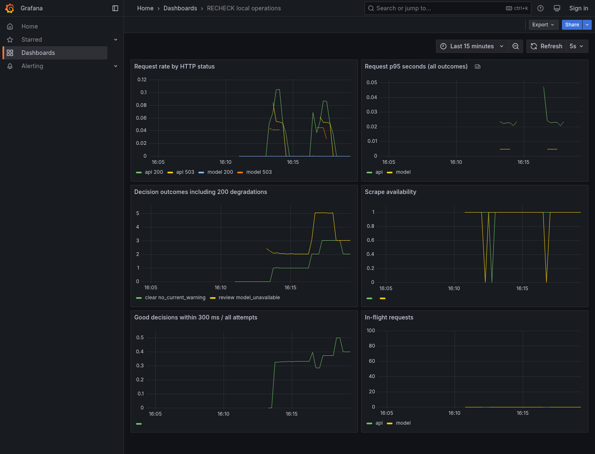
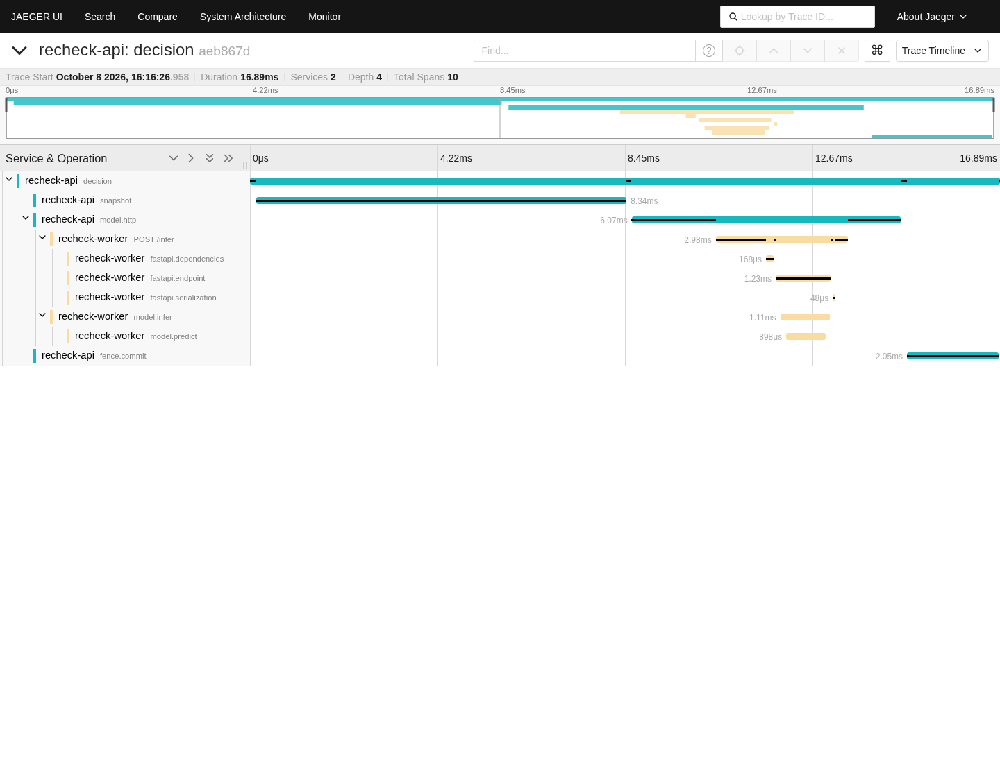

# RECHECK operations and test SLO

This is a reproducible local laboratory and a small public portfolio service, not a claim of production traffic, an uptime SLA, or years of on-call experience. The observability lab runs actual Prometheus, Grafana, an OpenTelemetry collector, Jaeger and Alertmanager. Notifications go only to an owned local HTTP receiver. SQLite in this lab is disposable; the separate Kubernetes lab uses persistent PostgreSQL.

## Reproduce the observability proof

From the repository root with Docker Compose and the Python dependencies installed:

```sh
docker build -t recheck:local .
docker compose -p recheck-observe -f compose.observability.yaml up -d
PYTHONPATH=backend backend/.venv/bin/python scripts/verify_observability.py
# Delete only this disposable lab when finished:
docker compose -p recheck-observe -f compose.observability.yaml down
```

In a managed proxy environment, keep Docker's proxy settings and pass the public CA through the Dockerfile's BuildKit secret: `--secret id=proxy_ca,src="$CODEX_PROXY_CERT"`. Use a writable `BUILDX_CONFIG` if required. Do not run this stack concurrently with the Kubernetes lab on a small disk: the managed Docker VFS driver copies layers and can exhaust the 32 GB filesystem. Sequential verification plus removal of identified, unused RECHECK build caches resolved this resource conflict. Both `NO_PROXY` and `no_proxy` list only local services because Python Requests prioritizes Docker's inherited lowercase variable. External traffic retains the configured proxy. The pinned FastAPI version also creates native telemetry: per-service `OTEL_SERVICE_NAME` identifies those spans; automatic OTLP metric/log exporters are disabled because this lab scrapes explicit Prometheus metrics and exports traces.

The verifier waits for both scrape targets, fetches Grafana's provisioned dashboard, submits a real decision, retrieves that exact trace from Jaeger and checks the worker's parent span is the API's client span. It then submits HTTP-200 degraded decisions, verifies the business counters, stops its own model container, waits for Alertmanager's firing webhook, restarts the model and waits for a resolved webhook. Every assertion and timestamp is saved in `docs/evidence/observability-latest.json`. Failed attempts also write evidence with `success: false`; generated JSON is not itself proof unless its checks pass.

| Local endpoint | Purpose |
| --- | --- |
| http://127.0.0.1:18100/metrics | API Prometheus exposition |
| http://127.0.0.1:19090 | Prometheus, rules, target status |
| http://127.0.0.1:13000/d/recheck-operations | Read-only anonymous Grafana dashboard |
| http://127.0.0.1:16686 | Jaeger exported traces |
| http://127.0.0.1:19093 | Alertmanager firing/resolved state |
| http://127.0.0.1:18090/events | Local webhook evidence, at most 256 events |

All published ports bind loopback. Do not expose the monitoring stack publicly without authentication. Trace storage and webhook events are deliberately bounded in-memory; Prometheus retention is two hours. Grafana and collector do not persist data. These retention choices suit a reproducible proof, not incident retention requirements.

## Executed result (2026-10-08 UTC)

[Machine-readable external-stack proof](evidence/observability-latest.json) passed from **16:16:26 to 16:17:04 UTC**, with 12 asserted checks. Both targets were scraped; Grafana returned its six provisioned panels; Jaeger returned trace `aeb867df9167e20197d9e182f11070cb` with **10 spans across `recheck-api` and `recheck-worker`**, including the worker span's explicit API-client parent. Captured runtime Python source hashes match the working tree. Prometheus, Alertmanager and collector configuration validators all passed.

| Owned synthetic event | Local webhook firing | Local webhook resolved |
| --- | --- | --- |
| HTTP-200 decisions degraded by injected model unavailability | 16:16:36 UTC | 16:17:04 UTC |
| Stopped model container / failed scrape | 16:16:44 UTC | 16:16:50 UTC |

During model failure, API liveness stayed 200 and readiness returned 503. After restart, the verifier obtained an actual `clear` decision with the expected model version, 64-character model hash, nonzero trace ID, and `valid: true`. These synthetic failure and recovery observations establish the wiring over this short interval; they do not establish 30-day availability. [Seven metrics/readiness tests](evidence/observability-tests.json) also passed; the final full backend regression passed **54 tests with one opt-in skip**. The [first export attempt](evidence/observability-attempt-proxy.json) failed because lowercase Docker proxy settings captured local OTLP traffic; the corrected local proxy exclusions are included in the successful configuration.

## Measurement contract

Metrics have bounded labels: service (`api`, `model`), HTTP method from a fixed vocabulary, registered route template or `unmatched`, status code, and allowlisted outcome/reason. Session IDs, decision IDs, request keys, raw paths and exception strings never become labels. Trace IDs remain in receipts and trace storage. Run one Uvicorn process per container: metrics registries are per process; scale by replicas with distinct scrape targets, not multiple uncoordinated workers behind one target.

`recheck_http_requests_total` and `recheck_http_request_duration_seconds` count requests through final ASGI response body, including 404, validation errors, rejects, unhandled exceptions and cancellation (499). Scrapes themselves are excluded. This measures application response completion, not proof the client received bytes. A proxy/client-side monitor is necessary to detect network failures before the application.

`recheck_business_outcomes_total` and `recheck_business_duration_seconds` count every POST that matched the decision/inference route, including validation failures and each retry or idempotent replay. They describe delivered attempts, not unique decisions or unique users. An idempotent replay preserves its historical receipt outcome; current usability must be checked with `/validate` and the separate freshness invariant. A review because of `risk_signal` is a successful execution; a review because of `model_unavailable` is degraded despite HTTP 200. Unknown reasons collapse to `other` and are conservatively treated as bad. Use API metrics only for the end-user SLO, otherwise worker calls would double-count requests.

## Explicit test objectives and denominators

These are proposed test objectives; a short local experiment cannot establish 30-day compliance.

1. **Decision service objective: 99% good attempts within 300 ms over 30 days.** Denominator: every completed API POST to `/api/sessions/{sid}/decisions`, including rejects, malformed requests, retries, cancellations and errors. Numerator: those attempts whose returned reason is `no_current_warning` or `risk_signal` and application duration is at most 0.3 seconds. Fenced invalidation and stale features count as bad under this conservative broad definition. It intentionally does not reward HTTP-200 degraded results. Report the workload/fault mix next to the ratio; do not filter failures out after measurement.
2. **Synthetic availability objective: 99% successful scheduled probes over 30 days.** Denominator: recorded scheduled probe attempts. Numerator: probes meeting the monitor's readiness/inference/version/trace checks and timeout. Record schedule gaps separately; absence of a check is not uptime. Network/timeouts count as failures. The public GitHub workflow runs hourly at minute 17 and takes three probes 15 seconds apart. Each good probe requires health, a real clear decision with identified model and trace, initial current validation, a feature-version increment after mutation, and rejection with `versions_changed` against the changed current versions, and total workflow duration at most 5,000 ms. Individual HTTP requests time out after 90 seconds; a cold-start success beyond the 5-second workflow objective still counts as bad. Clustered hourly samples may miss shorter outages.
3. **Freshness correctness invariant:** zero successful validations of a protected receipt against changed model, feature or policy versions. This is a test invariant with deterministic race tests, not a probabilistic availability percentage.

For the first objective, the PromQL ratio over a chosen window is:

```promql
sum(increase(recheck_business_duration_seconds_bucket{
  service="api",reason=~"no_current_warning|risk_signal",le="0.3"
}[30d]))
/
sum(increase(recheck_business_outcomes_total{service="api"}[30d]))
```

No traffic is undefined, not 100%. The local Prometheus retains only two hours, so use `[5m]` for the lab and provision at least 30 days of durable storage before asserting the 30-day objective. Prometheus `increase` extrapolates at window edges; use raw per-attempt benchmark/monitor records for exact finite-experiment counts. An HTTP histogram p95 across all statuses is displayed separately and is not sufficient to establish goodput.

Error budget for `N` attempts is `0.01 * N`; bad attempts are `N - good_on_time`. Budget consumed is `(N - good_on_time)/(0.01*N)` and burn rate is `bad_fraction/0.01`. Example: 10,000 attempts allow 100 bad attempts; 250 bad attempts consume 250% of budget and give a 2.5x burn rate. This is an arithmetic example, not a measured result. For time-based 99% availability, a 30-day budget would be 7.2 hours, but scheduled samples do not justify converting to exact downtime.

## Alert and incident runbook

The lab evaluates every two seconds. `RecheckTargetDown` fires after six seconds of failed scrapes; this is a measurement-path signal and may mean exporter/network failure rather than inference downtime. `RecheckDecisionFailures` flags any degraded API attempts in a rolling 30-second interval. These deliberately sensitive thresholds enable a short deterministic proof and are not production paging defaults. Production should require enough traffic and use multiwindow error-budget burn alerts after collecting representative baselines.

1. Record UTC detection time, alert payload, affected target, deployment revision and observation window. Preserve the first failing receipt's trace ID and aggregate status/outcome metrics without copying user payloads into alerts.
2. Check the API `/live` (process/event loop only) and `/ready` (database connectivity plus model readiness and expected hashes). `/health` preserves the readiness contract. If live succeeds but ready fails, inspect model and database first; restarting all API replicas can worsen a dependency failure. The worker also fails liveness when its CPU process pool is irrecoverably broken, allowing a restart instead of permanently routing to a dead executor. Database checks run in a thread and database-side connect/statement timeouts bound ordinary failures; infrastructure-wide pool exhaustion still requires investigation.
3. Inspect HTTP 429 and deadline outcomes, in-flight requests, CPU workload benchmark limits, and worker admission occupancy. Reduce offered load or roll back a costly change before raising concurrency. A cancelled CPU task must retain its admission slot until the process exits/completes; do not treat a client timeout as released compute.
4. Retrieve the receipt's trace from Jaeger. Confirm `decision -> model.http -> model.infer -> model.predict` linkage. If the UI has local display spans but Jaeger does not, inspect collector/exporter logs and queue/memory limits: local receipt spans alone do not prove export.
5. For registry mismatch or a failed rollout, stop promotion and run the documented Kubernetes rollback. Confirm the restored model hashes, durable receipts, readiness and actual inference. For database loss, follow the PostgreSQL persistence/recovery procedure; never silently substitute a fresh SQLite database for the persistent deployment.
6. Recover the failing target, wait for readiness and scrape recovery, execute a successful protected decision and validation, then verify the **resolved** webhook. Record recovery time and exact evidence, and calculate impact from all observed attempts. Do not call a restart alone recovery.
7. Write the incident's cause, contributing load/resource conditions, detection gap and corrective change. The executed monitoring lab encountered shared-host disk exhaustion before startup; verification was sequenced after the Kubernetes lab rather than hiding the resource conflict. No customer incident is implied.

Public checks, if configured, measure only their stated observation interval. Render free-service sleep, ephemeral public SQLite storage, missing multi-region redundancy, short local retention and single-host Kubernetes failure boundaries remain explicit limits.

## 실제 화면

최종 검증 직후 실행 중인 서비스를 열어 캡처했다. 수치를 그린 목업이 아니다.




